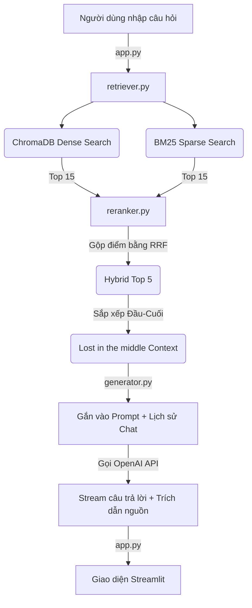

# Báo Cáo Triển Khai Hệ Thống RAG Chatbot Nâng Cao
**Chủ đề:** Trợ lý ảo tra cứu Pháp luật Phòng, chống ma túy
**Ngôn ngữ lập trình:** Python

---

## 1. Danh sách thành viên & Phân công công việc (Chi tiết)

Dự án được tái cấu trúc hoàn toàn dưới dạng **Modular RAG**, chia tách triệt để thành 5 tệp tin độc lập. Mỗi thành viên sở hữu 1 tệp tin mã nguồn, đảm bảo việc hợp tác nhóm trên Github không bao giờ xảy ra xung đột (conflict).

| STT | Thành viên | MSSV | Tệp mã nguồn | Nội dung thực hiện (Thuật toán) |
|:---:|---|---|---|---|
| 1 | **Đỗ Quốc An** (Trưởng nhóm) | 2A202600952 | `app.py` | Phát triển giao diện Streamlit, thiết kế luồng hội thoại (Session State) và đóng vai trò **Integrator** liên kết 4 module còn lại. |
| 2 | **Nguyễn Khánh Linh** | 2A202600856 | `data_processor.py` | Quét dữ liệu thư mục `.md`/`.txt`, phân mảnh bằng `RecursiveCharacterTextSplitter`. Xây dựng CSDL Vector (ChromaDB) và CSDL Từ vựng (`BM25Okapi`). |
| 3 | **Trần Diệu Linh** | 2A202600875 | `retriever.py` | Lập trình truy vấn song song (Hybrid Search): **Dense Search** (đo lường độ tương đồng ngữ nghĩa bằng Cosine Similarity) và **Sparse Search** (so khớp từ khóa bằng BM25). |
| 4 | **Thân Minh Hiếu** | 2A202600854 | `reranker.py` | Áp dụng công thức **Reciprocal Rank Fusion (RRF)** gộp điểm hai bộ máy tìm kiếm. Tái sắp xếp tài liệu theo mô hình **Lost-in-the-Middle**. |
| 5 | **Trần Minh Quang** | 2A202600924 | `generator.py` | Lập trình Prompt Engineering chống ảo giác (hallucination). Gọi API OpenAI `gpt-4o-mini` để sinh văn bản kèm chú thích nguồn tài liệu [1], [2]. |

---

## 2. Kiến Trúc Thuật Toán RAG Nâng Cao (Advanced RAG)

Hệ thống của chúng em không dừng lại ở mức RAG cơ bản (Naive RAG) mà áp dụng các thuật toán chuyên sâu để tăng tối đa độ chính xác của tài liệu pháp luật.

### 2.1 Hybrid Search (Tìm kiếm lai)
RAG truyền thống (chỉ dùng Vector Search) thường gặp lỗi khi người dùng tìm kiếm chính xác các điều khoản luật (ví dụ "Điều 255 Bộ luật Hình sự"). Để khắc phục, hệ thống chạy song song 2 thuật toán:
- **Dense Retrieval:** Sử dụng mô hình `all-MiniLM-L6-v2` chuyển đổi văn bản thành vector. Bắt được **ý nghĩa** của câu hỏi.
- **Sparse Retrieval:** Sử dụng thuật toán đếm tần suất từ khóa `BM25Okapi`. Bắt được chính xác **từ vựng**, mã số điều luật.

### 2.2 Thuật toán Reciprocal Rank Fusion (RRF)
Với 2 danh sách kết quả trả về từ Hybrid Search, hệ thống cần một cách công bằng để chọn ra tài liệu tốt nhất. Chúng em lập trình công thức RRF:

$$ RRF\_Score = \frac{1}{k + rank_{dense}} + \frac{1}{k + rank_{sparse}} $$

Trong đó $k=60$ là hằng số tiêu chuẩn. Chunk nào đứng top ở cả 2 phương pháp sẽ có điểm RRF cao nhất.

### 2.3 Thuật toán Lost-in-the-Middle
Nghiên cứu chỉ ra rằng các mô hình ngôn ngữ lớn (LLM) thường "quên" hoặc "bỏ qua" các thông tin nằm ở **giữa** đoạn văn bản context dài. Do đó, sau khi có được 5 tài liệu tốt nhất từ bước RRF, chúng em sắp xếp lại chúng thành mô hình chữ U:
- Chunk hạng 1: Nằm đầu tiên.
- Chunk hạng 2: Nằm cuối cùng (sát với câu hỏi của User nhất).
- Chunk hạng 3, 4, 5: Nhét vào giữa.

### 2.4 Streaming Generation & Citation
Bên trong `generator.py`, hệ thống không bắt người dùng chờ 10-15s để lấy toàn bộ câu trả lời, mà sử dụng cơ chế **Streaming** chảy từng chữ ra màn hình giống hệt ChatGPT. Prompt được thiết lập nghiêm ngặt yêu cầu LLM trích dẫn nguồn theo format `[N]`.

---

## 3. Sơ Đồ Luồng Dữ Liệu (Data Flow)



---

## 4. Hướng Dẫn Vận Hành

Để chạy hệ thống trên máy ảo hoặc local, vui lòng thực hiện các bước sau:

**Bước 1: Cấu hình môi trường**
Đảm bảo đã cung cấp `OPENAI_API_KEY` trong tệp tin `.env` nằm ở thư mục gốc của dự án.

**Bước 2: Xây dựng CSDL Vector (Chỉ chạy 1 lần duy nhất)**
```bash
python group_project/data_processor.py
```
> Lệnh này sẽ tự động đọc thư mục `data/standardized/`, chia chunk, và tạo thư mục `group_project/chroma_db` cũng như file `group_project/bm25_index.pkl`.

**Bước 3: Chạy Chatbot Giao Diện UI**
```bash
streamlit run group_project/app.py
```
> Giao diện sẽ tự động mở trên trình duyệt tại cổng `localhost:8501`. Hệ thống hỗ trợ hoàn toàn hội thoại nhiều lượt (Multi-turn conversation).